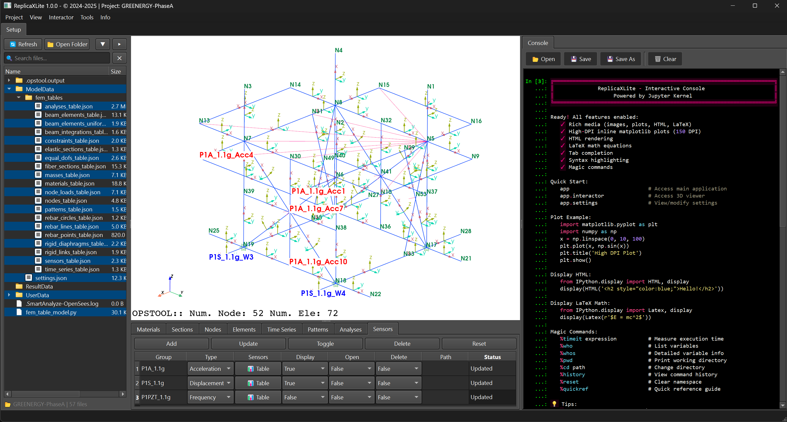

# ReplicaXLite

**A finite element toolkit for creating, analyzing and monitoring 3D structural models**

[](https://www.gnu.org/licenses/gpl-3.0)
[](https://www.python.org/downloads/)

## Overview

ReplicaXLite is a comprehensive finite element toolkit built with Python. It provides programatic and graphical interface for creating, analyzing, and monitoring 3D structural models using `OpenSeesPy` as the computational backend and `opstool` as visualization backend.

## Features

- **Modular API**: Structural, Sensors, Units, DataValidation, Table
- **3D Model Creation**: Interactive 3D modeling with the Structural API
- **Finite Element Analysis**: Built on `OpenSeesPy` + `opstool` for robust structural analysis
- **Sensor Data Integration**: Tools for processing and analyzing sensor data
- **Visualization**: Advanced 3D rendering with multiple view modes
- **Console Interface**: Integrated Python console for advanced scripting
- **Graphic User Interface**: Modern interface built with `PySide6`
- **OpenSees Result Integration**: Native support for `OpenSees` recorder files

## Citation

If you use ReplicaXLite in your research, please cite it using the following format:

> Vanian V. and Rousakis T., "ReplicaXLite: A finite element toolkit for creating, analyzing and monitoring 3D structural models," GitHub Repository, 2025, 
https://github.com/Vachan-Vanian/ReplicaXLite.

For BibTeX:
```bibtex
@software{vanian2025_replicaxlite,
  author       = {Vanian, Vachan and Rousakis, Theodoros},
  title        = {{ReplicaXLite: A finite element toolkit for creating, analyzing and monitoring 3D structural models}},
  year         = {2025},
  publisher    = {GitHub},
  journal      = {GitHub Repository},
  url          = {https://github.com/Vachan-Vanian/ReplicaXLite}
}
```

## Installation

### Prerequisites

- Python 3.11.9
- Windows, Linux (beta)
- [Anaconda or Miniconda](https://www.anaconda.com/docs/getting-started/miniconda/main) (recommended for dependency management)

### Create Conda Environment (Recommended)

For the best experience and to avoid dependency conflicts, it is recommended to use a conda environment:

```bash
# Create a new conda environment with Python 3.11.9
conda create -n replicax python=3.11.9

# Activate the environment and install git
conda activate replicax
conda install git
```

### Install from Source

```bash
git clone https://github.com/Vachan-Vanian/ReplicaXLite.git
cd ReplicaXLite

# Install the package
# For regular users
pip install .

# For developers 
# Editable mode: Changes to source code are reflected immediately
# If new files are created, the command should be run again
pip install -e . --config-settings editable_mode=strict
```

## Quick Start

### Launch the Application

After installation, you can use ReplicaXLite in several ways:

```bash
conda activate replicax
# Command line
replicaxlite

# Or using the short alias
replicax
```

### Programmatic Usage

```python
# Launch the main GUI
from replicaxlite import ReplicaXLiteApp
app = ReplicaXLiteApp()
```


## Screenshots


*Main interface showing the 3D viewport, console and property panels*

## Dependencies

ReplicaXLite is built on top of several powerful libraries:

- **OpenSeesPy**: Finite element analysis engine
- **opstool**: Finite element visualization and analysis
- **PySide6**: Modern Qt-based GUI framework
- **PyVista**: 3D visualization and mesh processing
- **NumPy**: Numerical computing
- **Matplotlib**: Plotting and visualization


## Documentation

- [Help](docs/)

## Contributing

We welcome contributions! Please see our [Contributing Guide](CONTRIBUTING.md) for details.

## License

This project is licensed under the GNU General Public License v3.0 - see the [LICENSE](LICENSE) file for details.

## Changelog

### Version 1.0.0
- Initial release

## Support

If you encounter any issues or have questions:

1. Check the [Documentation](docs/)
2. Search [Issues](https://github.com/Vachan-Vanian/ReplicaXLite/issues)
3. Create a new issue if needed

## Acknowledgments

The research project is implemented in the framework of H.F.R.I call "Basic research Financing (Horizontal support of all Sciences)" under the National Recovery and Resilience Plan "Greece 2.0" funded by the European Union—NextGenerationEU (H.F.R.I. Project Number: 015376).

<p align="center">
  
  &nbsp;&nbsp;&nbsp;&nbsp;
  
</p>

<p align="center">
  
</p>